# TypeScript Chat Socket IO Project

This is a real-time chat application built with TypeScript and Socket.io, allowing users to communicate through direct messages, group messages, and channels. The application offers bidirectional communication between clients and the server, providing a seamless chat experience.

## Features

- **User-to-User Direct Messaging:** Users can send direct messages to each other privately.
- **Group Messaging:** Users can participate in group conversations with multiple participants.
- **Channels:** Users can join and send messages to public channels.

## Prerequisites

Before running this project, ensure you have the following prerequisites installed on your system:

- Node.js (v18.13.0)
- npm (Node Package Manager) "9.2.0"
- Socket.io "^4.7.1"

## Getting Started

Clone this repository to your local machine:

```bash
git clone https://github.com/BaseMax/ChatTypeScriptSocketIO
cd ChatTypeScriptSocketIO
```

Install project dependencies:

```bash
npm install
```

## Usage

### Starting the WebSocket Server

To start the WebSocket server, run the following command:

```bash
npm run start dev
```

This will launch the server and bind it to a specified port (default is 8080). The server will be ready to accept WebSocket connections from clients.

The client will attempt to connect to the WebSocket server running on the specified host and port. You can adjust the server host and port in the `src/client.ts` file.

# Join to socket.io

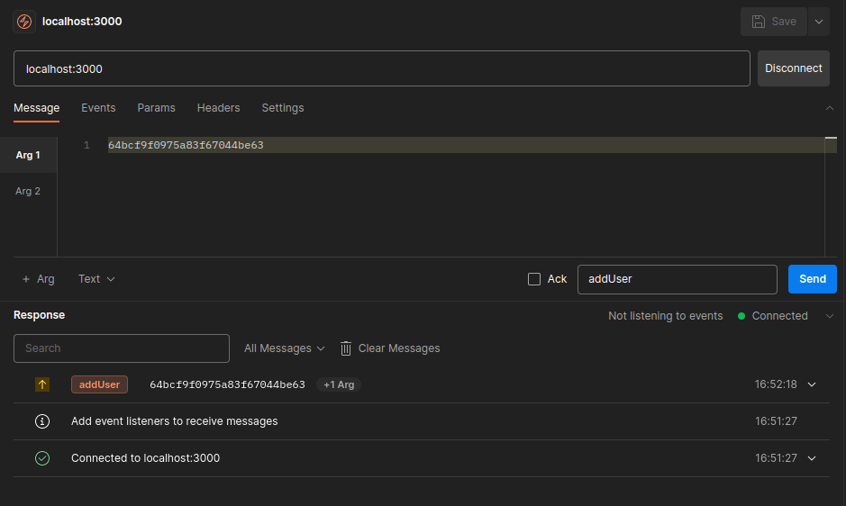

# Private chat

## Get private

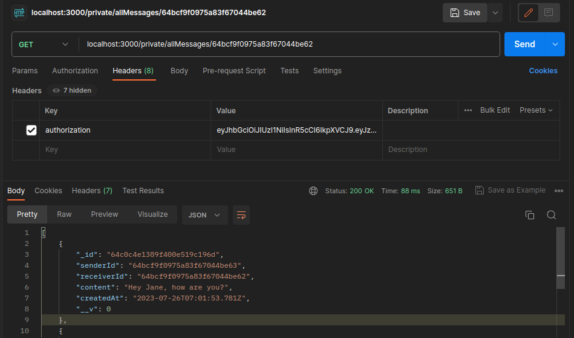

## Received private message

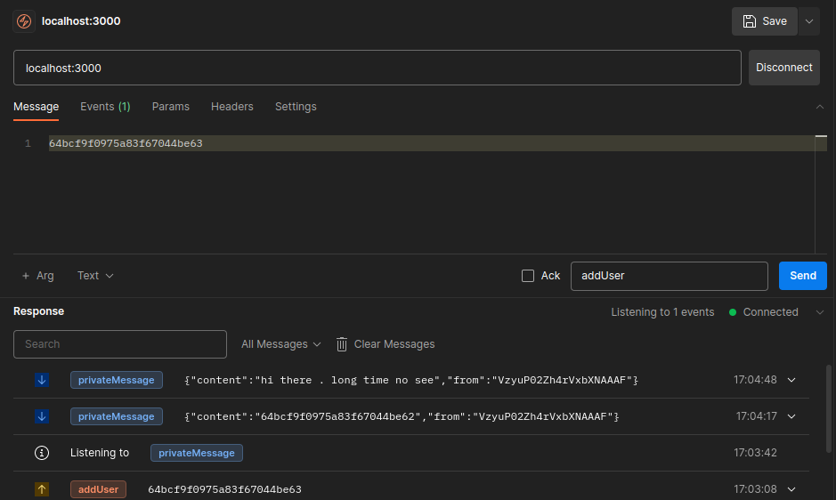

## Update private message

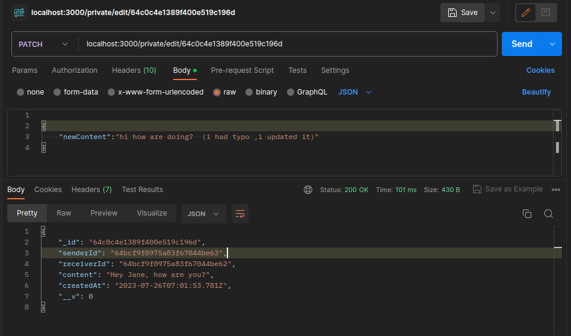

## Delete message in private chat

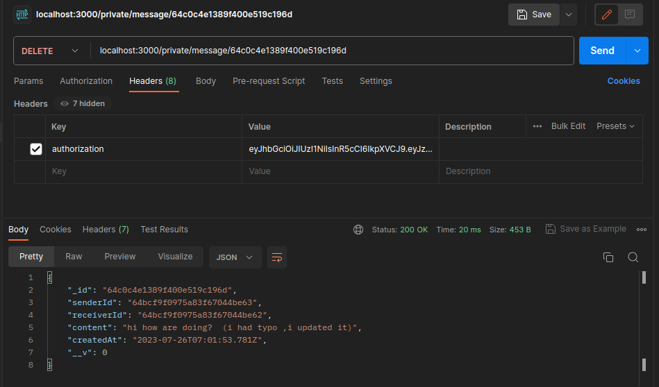

# Group

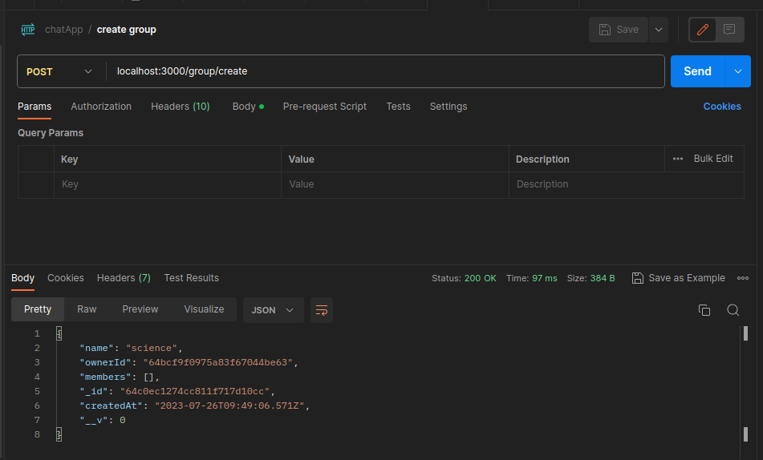

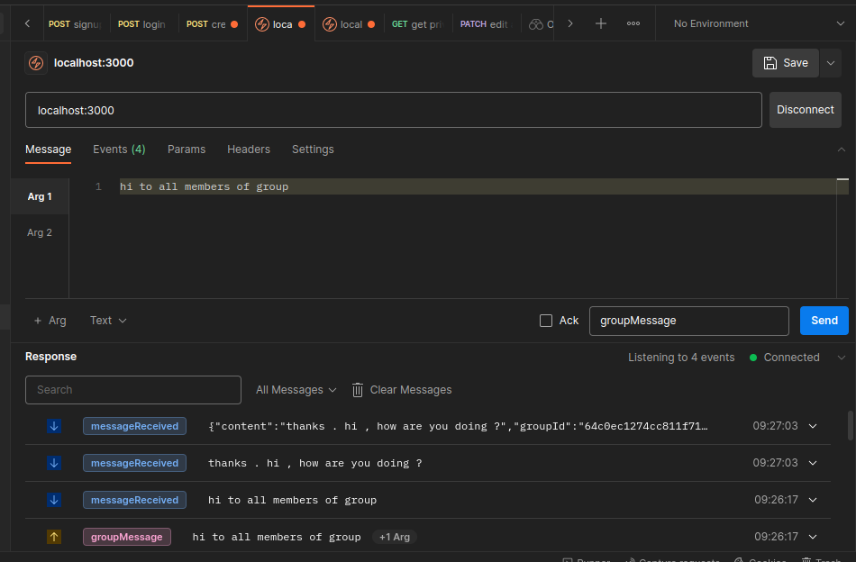

# Channel

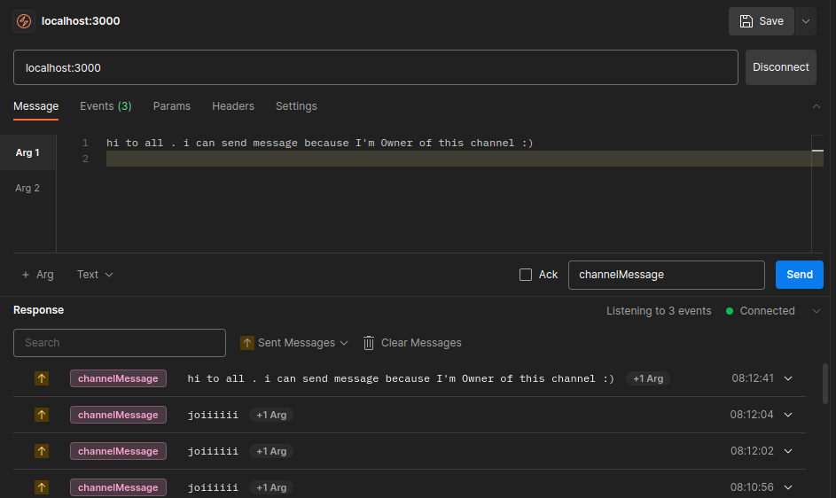

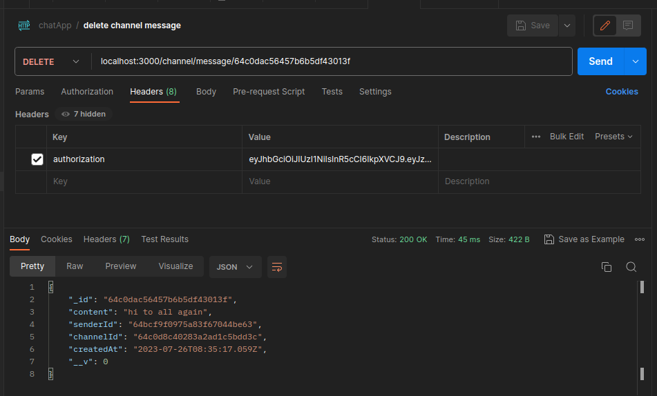

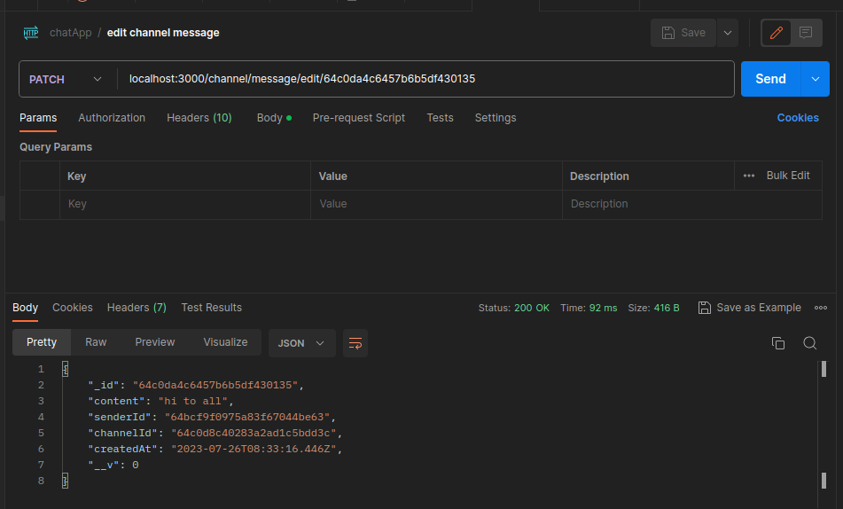

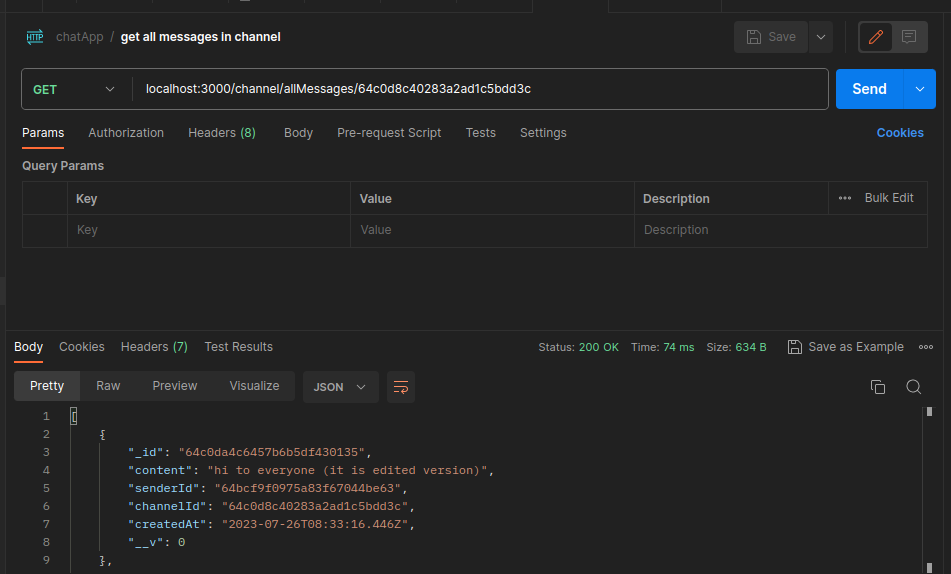

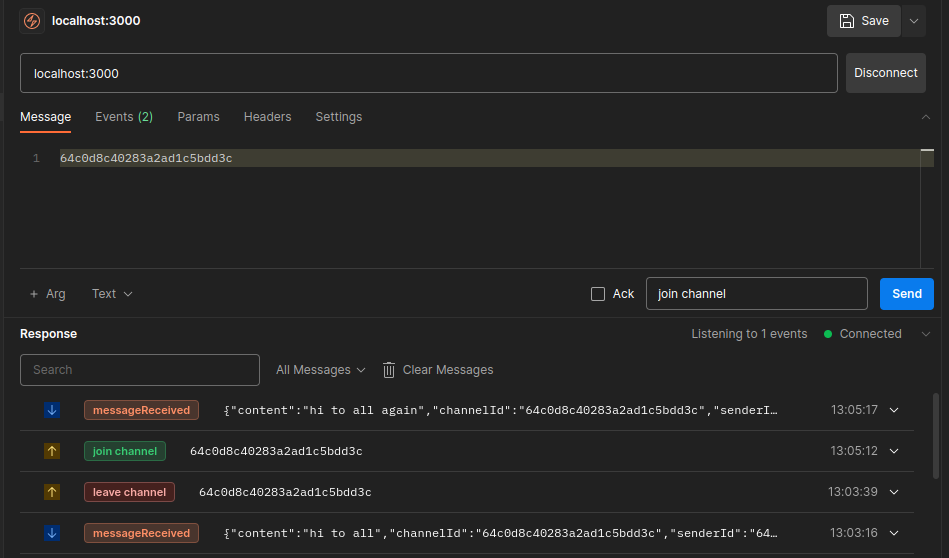

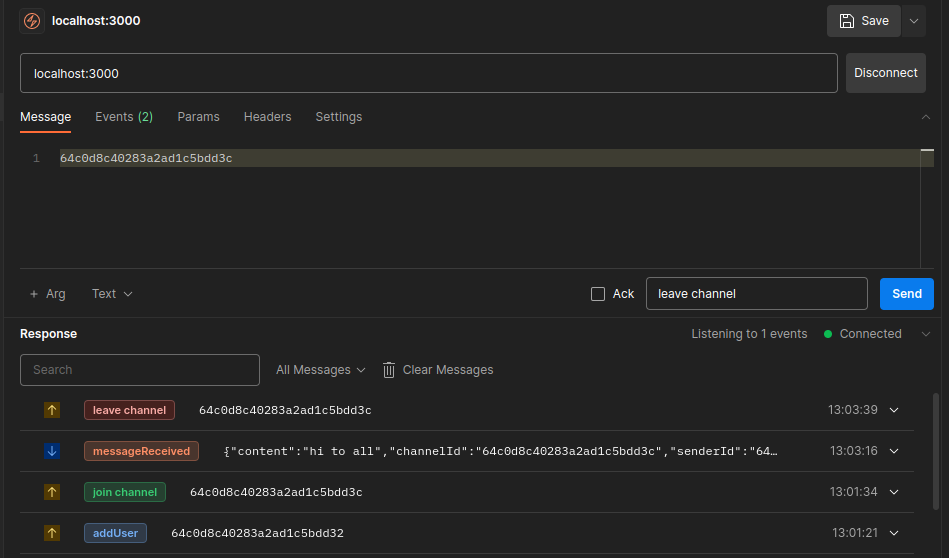

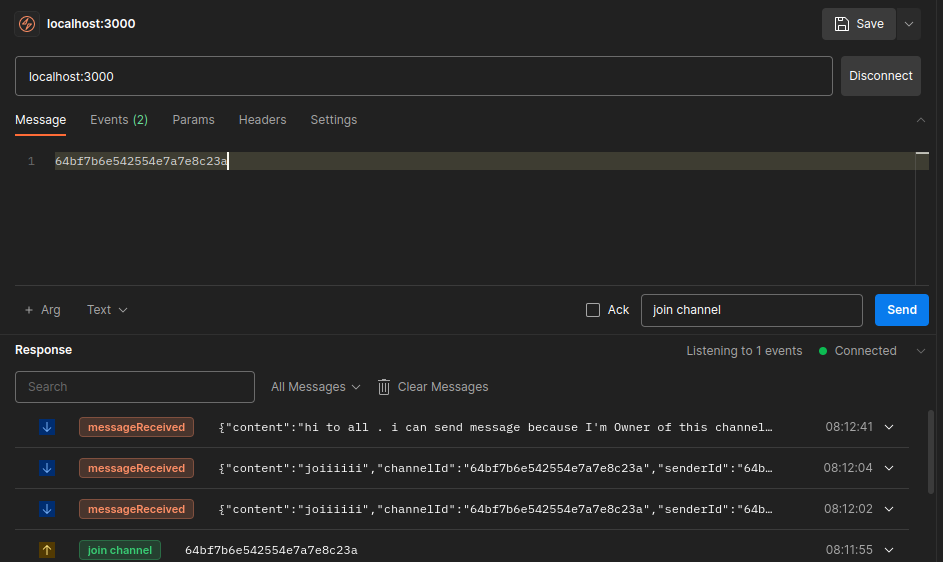

## Configuration

You can modify the WebSocket server settings in the src/server.ts file:

- `PORT`: The port on which the WebSocket server will listen for incoming connections.

You can adjust the WebSocket client settings in the src/client.ts file:

- `SERVER_HOST`: The hostname or IP address of the WebSocket server.
- `SERVER_PORT`: The port on which the WebSocket server is running.

## Contributing

Contributions to this project are welcome. If you find any issues or have suggestions for improvements, feel free to open an issue or submit a pull request.

## License

This project is licensed under the GPL-3.0 License.

Copyright 2023, Max Base
